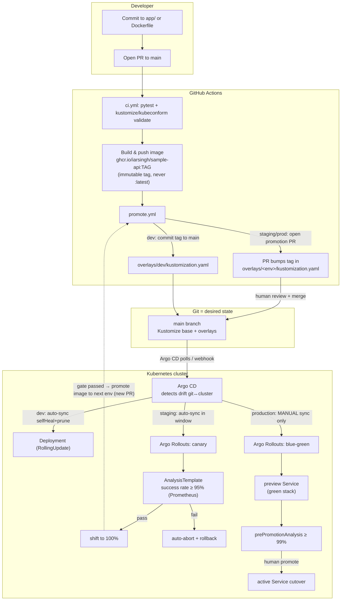

# Architecture

## GitOps flow

## Component responsibilities

| Layer | Component | Responsibility |
|-------|-----------|----------------|
| Workload | `sample-api` (FastAPI) | The application being deployed. Exposes `/health`, `/ready`, `/metrics`. |
| Packaging | Dockerfile (multi-stage, non-root) | Reproducible, hardened container image. |
| Config | Kustomize base + overlays | One base, three environment overlays. Only the diff per env lives in the overlay. |
| Delivery | Argo CD Applications + AppProjects | Reconcile git → cluster. Per-env sync policy and least-privilege scoping. |
| Progressive delivery | Argo Rollouts | Canary (staging) and blue-green (production) with analysis gates. |
| Promotion | GitHub Actions (`promote.yml`) | PR-based image-tag promotion between environments. |
| Guardrails | Kyverno ClusterPolicies | Enforce resource limits, non-root, no `:latest`, require PDB. |
| Secrets | SealedSecrets / External Secrets | No plaintext secrets in git. |

## Why these choices

- **Kustomize over Helm here** — the workload is simple and the interesting axis is
  environment overlays. Kustomize's patch model keeps each environment's diff
  explicit and reviewable, and `kustomize edit set image` gives promotion a clean,
  scriptable one-liner. (Helm would be the better fit once templating logic grows.)
- **One base, a Rollout via `workloadRef`** — the base ships a plain `Deployment`
  (used directly in dev). Staging/production add an Argo Rollouts `Rollout` that
  adopts the base Deployment's pod template via `spec.workloadRef` and scales the
  Deployment to zero. This avoids duplicating the pod spec three times while still
  letting each environment pick its own rollout strategy.
- **Different strategy per environment** — dev optimizes for speed (RollingUpdate),
  staging for automated confidence (canary + metric analysis), production for
  control and instant rollback (blue-green with manual promotion).
- **App-of-apps** — a single root Application renders the three child Applications,
  so bootstrapping the whole stack is one `kubectl apply`.

## Namespaces and scoping

| Environment | Namespace | AppProject | Cluster |
|-------------|-----------|------------|---------|
| dev | `sample-api-dev` | `sample-api-nonprod` | in-cluster |
| staging | `sample-api-staging` | `sample-api-nonprod` | in-cluster |
| production | `sample-api-production` | `sample-api-prod` | in-cluster |

Each AppProject restricts the source repo, destination namespaces, and the set of
resource kinds its Applications may create — least privilege by construction.
